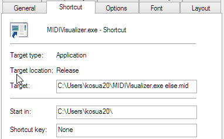

# MIDI Visualizer

A small MIDI visualizer, written in C++/OpenGL. 

  

## Usage

### macOS & Linux

You can run the executable from the command-line, specifying a MIDI file to read, along with optional settings such as the scale and color of the notes (by setting the red, green and blue components as numbers between 0.0 and 1.0).

    ./MIDIVisualizer path/to/file.mid [scale] [red green blue]
    
If no arguments is specified (for instance by double-clicking on the executable instead of using the command-line), the executable will try to load the `song.mid` file from the directory where it resides.

### Windows

You can run the executable from the command-line, specifying a MIDI file to read, along with optional settings such as the scale and color of the notes (by setting the red, green and blue components as numbers between 0.0 and 1.0).

    MIDIVisualizer.exe path\to\file.mid [scale] [red green blue]
    
If you're not familiar with command-line, you can create a shortcut to the executable and specify the arguments in its properties. Right-click on the shortcut icon, select `Properties`, then the `Shortcut` tab, and append the arguments in the `Target` field.

If no arguments is specified (for instance by double-clicking on the executable instead of using the command-line or the shortcut method), the executable will try to load the `song.mid` file from the directory where it resides.

## Development

Main development steps were:

- loading a MIDI file, and parsing the notes contained,
- displaying a scrolling score with these notes,
- adding visual effects to embellish the visualization.

More details [on my blog](http://blog.simonrodriguez.fr/articles/28-12-2016_midi_visualization_a_case_study.html).

  

  
