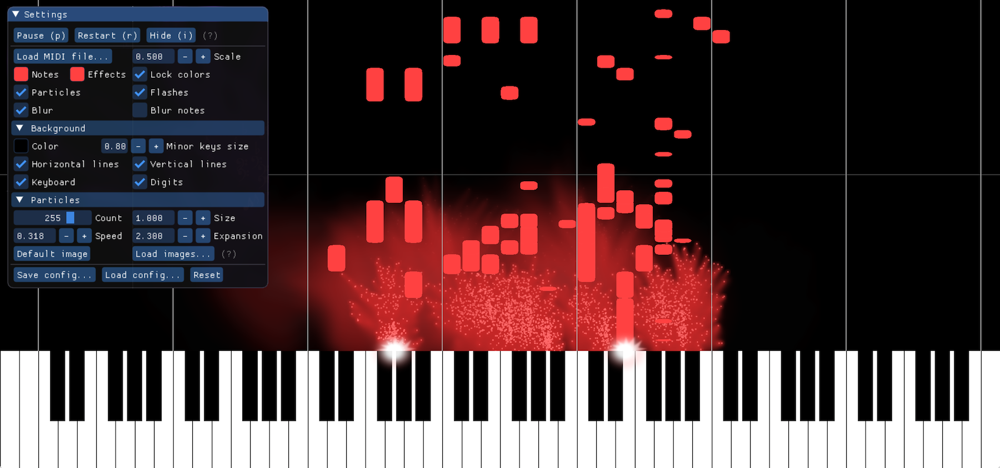
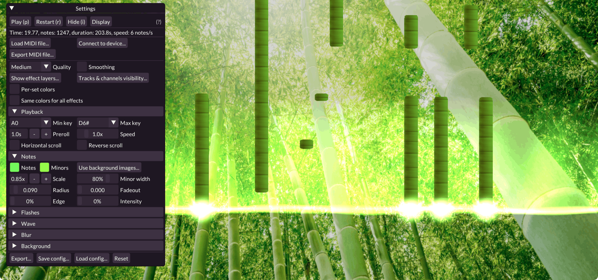
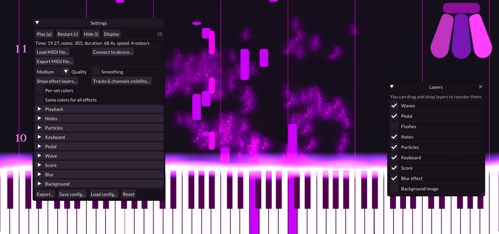

# MIDI Visualizer

A small MIDI visualizer, written in C++/OpenGL.
Binaries for Windows, macOS and Ubuntu (experimental) are available in the [Releases tab](https://github.com/kosua20/MIDIVisualizer/releases).
See the [troubleshooting section](#troubleshooting) if you encounter any issue.

  

## Usage

On Windows and macOS platforms, you can now **run the application by simply double-clicking** on it. You will then be able to select a MIDI file to load. A *Settings* panel allows you to modify display parameters such as color, scale, lines,... Images and videos of the track can be exported. Note that MIDIVisualizer is currently not able to *play* soundtracks, only *display* them.

Press `p` to play/pause the track, `r` to restart at the beginning of the track, and `i` to show/hide the *Settings* panel. 

 

## Command-line use

You can also run the executable from the command-line, specifying a midi file and display options. You can also trigger a video export directly from the command line. For instance:
	
	./MIDIVisualizer --midi path/to/file.mid --size 1920 1080 --config my/config.ini --export video.mp4  --format MPEG4
	
### General options

	--midi              path to a MIDI file to load
	--config            path to a configuration INI file
	--size              dimensions of the window (--size W H)
	--fullscreen        start in fullscreen (1 or 0 to enabled/disable)
	--gui-size          GUI text and button scaling (number, default 1.0)
	--version           display the current version and build information
	--help              display a detailed help of all options
	
### Export options
If you want to directly export a video/images, `--export ...` is mandatory. You can completely hide the application window using `--hide-window`.

	--export            path to the output video (or directory for PNG)
	--format            output format (values: PNG, MPEG2, MPEG4)
	--framerate         number of frames per second to export (integer)
	--bitrate           target video bitrate in Mb (integer)
	--png-alpha         use transparent PNG background (1 or 0 to enabled/disable)
	--hide-window       do not display the window (1 or 0 to enabled/disable)
	
### Configuration options
If display options are given, they will override those specified in the configuration file. Almost every option available in the GUI can be specified on the command line, refer to the detailed help for a complete list (`./MIDIVisualizer --help`). Options include:

	--color-bg          Background color (R G B in [0.0, 1.0])
	--flashes-size      Flash effect size (number in [0.100000,3.000000])
	--particles-count   Particles count (integer in [1,512])
	--preroll           Preroll time in seconds before starting to play (number)
	--quality           Rendering quality (values: LOW_RES, LOW, MEDIUM, HIGH, HIGH_RES)	--show-keyboard     Should the keyboard be shown (1 or 0 to enable/disable)
	...

 

## Troubleshooting

Please note that MIDIVisualizer requires OpenGL 3.2 or higher on all platforms.

- *MIDIVisualizer is not playing any sound.*  
MIDIVisualizer is only a MIDI viewer, and does not currently support audio playback.

- *I have encountered an issue while using MIDIVisualizer.*  
You can open an issue ticket [here](https://github.com/kosua20/MIDIVisualizer/issues/new?assignees=&labels=bug&template=issue-report.md&title=). Please also check the issue [page](https://github.com/kosua20/MIDIVisualizer/issues), as some other people might have encountered a similar issue or offer help to your questions.

### Windows

- *I can't open the application as it is blocked by Safeguard.*  
MIDIVisualizer is not generated with a Microsoft developer certificate, thus the warning. You can still run the application by allowing it in the Safeguard message panel.

- *I get an error message about a missing `vcruntime140_1.dll`.*  
This is a Windows component (part of the *Microsoft Visual C++ Redistributable for Visual Studio 2015, 2017 and 2019*) that is often updated, you should try installing the latest version from the [Microsoft support website](https://support.microsoft.com/en-us/help/2977003/the-latest-supported-visual-c-downloads) (`vc_redistx64`).

### macOS

- *I can't open the application as it is considered unsafe.*  
MIDIVisualizer is not generated with an Apple developer certificate, thus the warning. You can still run the application by doing a right-click on it and selecting 'Open', this will mark the application as 'authorized' for future use.

### Ubuntu

- *I can't run MIDIVisualizer by double-clicking it in the file manager.*  
This seems to be a limitation of the Nautilus file manager, you can either double-click the companion script, or create and register a .desktop file.

## Compilation

The project is configured using Cmake. You can use the Cmake GUI ('source directory' is the root of this project, 'build directory' is build/, press 'Configure' then 'Generate', selecting the proper generator for your target platform and IDE); or the command line version, specifying your target generator.
    
Depending on the target you chose in Cmake, you will get either a Visual Studio solution, an Xcode workspace or a set of Makefiles. You can build the main executable using the `MIDIVisualizer`sub-project/target. If you update the images or shaders in the `resources` directory, you will have to repackage them with the executable, by building the `Packaging` sub-project/target. 

### Dependencies

MIDIVisualizer depends on the [GLFW3 library](http://www.glfw.org), the [Native File Dialog library](https://github.com/mlabbe/nativefiledialog) and [RtMidi17](https://github.com/jcelerier/RtMidi17/), all included in the repository and built along with the main executable. It also optionally relies on [FFMPEG](https://ffmpeg.org) v4.2 for video export. For licensing reasons only MPEG-2 and MPEG-4 exports are supported for now in the release builds.

On macOS and Windows, no additional dependencies are required. On Linux, you will need to have the following packages installed: `xorg-dev libgtk-3-dev libasound2-dev`, and if you plan on using FFMPEG, `ffmpeg libavcodec-dev libavformat-dev libavdevice-dev`.

## Development

The main development steps were:

- loading a MIDI file, and parsing the notes contained,
- displaying a scrolling score with these notes,
- adding visual effects to embellish the visualization,
- maintaining the application and listening to user requests :)

More details on the initial project [on my blog](http://blog.simonrodriguez.fr/articles/28-12-2016_midi_visualization_a_case_study.html).

 

 
